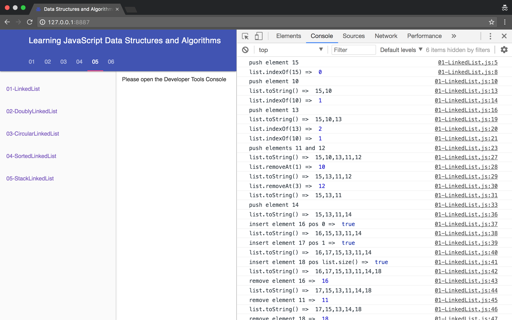

# Learning JavaScript Data Structures and Algorithms - Third Edition
This is the code repository for [Learning JavaScript Data Structures and Algorithms - Third Edition](https://www.packtpub.com/web-development/learning-javascript-data-structures-and-algorithms-third-edition?utm_source=github&utm_medium=repository&utm_campaign=9781788623872), published by [Packt](https://www.packtpub.com/?utm_source=github). It contains all the supporting project files necessary to work through the book from start to finish.
## About the Book
JavaScript is one of the most popular programming language nowadays. It is known as the internet language due the fact that the browser understands JavaScript natively, without installing any plugins in it. JavaScript has grown so much that is no longer just a frontend language; it is also present now on the server (NodeJS), database (MongoDB), and mobile devices and is also used in embedded and Internet of Things (IoT) devices.

Learning data structures is very important for any technology professional. Working as a developer means you are able to solve problems with the help of programming languages, and data structures are an indispensable piece of the solutions we need to create to solve these problems. Choosing a wrong data structure can also have an impact on the performance of the program we are writing. That is why, it's important to get to know different data structures and how to apply them properly.

Algorithms are the state of art of computer science. There are so many ways of solving the same problem, and some approaches are better than the others. That is why, it's also very important to know the most famous algorithms.
This book was written for beginners who want to learn data structures and algorithms and also for those who are already familiar with data structures and algorithms, but want to learn it using JavaScript.

Happy coding!
## Instructions and Navigation
All of the code is organized into folders. Each folder starts with a number followed by the application name. For example, Chapter02.


The code will look like the following:
```
class Stack {
  constructor() {
    this.items = []; // {1}
  }
}
```

Although this book provides a brief introduction on JavaScript in its first chapter, you will need a basic knowledge of JavaScript and programming logic.

To test the code examples provided by this book, you will need a code editor (such as Atom or Visual Studio Code) so that you can read the code and also a browser (Chrome, Firefox, or Edge).

 Also, remember to open the developer tools of the browser so that you can see what is being outputted in the browser's console.

## Related Products
* [Mastering JavaScript Functional Programming](https://www.packtpub.com/web-development/mastering-javascript-functional-programming?utm_source=github&utm_medium=repository&utm_campaign=9781787287440)

* [Learn ECMAScript - Second Edition](https://www.packtpub.com/web-development/learn-ecmascript-second-edition?utm_source=github&utm_medium=repository&utm_campaign=9781788620062)

* [JavaScript: Functional Programming for JavaScript Developers](https://www.packtpub.com/web-development/javascript-functional-programming-javascript-developers?utm_source=github&utm_medium=repository&utm_campaign=9781787124660)


Learning JavaScript Data Structures and Algorithms
====================================

[](https://travis-ci.org/loiane/javascript-datastructures-algorithms)
[](https://codecov.io/gh/loiane/javascript-datastructures-algorithms)
[](https://david-dm.org/loiane/javascript-datastructures-algorithms?type=dev)
[](https://david-dm.org/loiane/javascript-datastructures-algorithms)
[](https://greenkeeper.io/)


Source code of **Learning JavaScript Data Structures and Algorithms** book, third edition.

## List of available chapters:

* 01: [JavaScript: a quick overview](https://github.com/loiane/javascript-datastructures-algorithms/tree/third-edition/examples/chapter01)
* 02: [ECMAScript and TypeScript Introduction](https://github.com/loiane/javascript-datastructures-algorithms/tree/third-edition/examples/chapter02)
* 03: [Arrays](https://github.com/loiane/javascript-datastructures-algorithms/tree/third-edition/examples/chapter03)
* 04: [Stacks](https://github.com/loiane/javascript-datastructures-algorithms/tree/third-edition/examples/chapter04)
* 05: [Queues and Deques](https://github.com/loiane/javascript-datastructures-algorithms/tree/third-edition/examples/chapter05)
* 06: [LinkedLists](https://github.com/loiane/javascript-datastructures-algorithms/tree/third-edition/examples/chapter06)
* 07: [Sets](https://github.com/loiane/javascript-datastructures-algorithms/tree/third-edition/examples/chapter07)
* 08: [Dictionaries and Hashes](https://github.com/loiane/javascript-datastructures-algorithms/tree/third-edition/examples/chapter08)
* 09: [Recursion](https://github.com/loiane/javascript-datastructures-algorithms/tree/third-edition/examples/chapter09)
* 10: [Trees](https://github.com/loiane/javascript-datastructures-algorithms/tree/third-edition/examples/chapter10)
* 11: [Heap](https://github.com/loiane/javascript-datastructures-algorithms/tree/third-edition/examples/chapter11)
* 12: [Graphs](https://github.com/loiane/javascript-datastructures-algorithms/tree/third-edition/examples/chapter12)
* 13: [Sorting and Searching Algorithms](https://github.com/loiane/javascript-datastructures-algorithms/tree/third-edition/examples/chapter13)
* 14: [Algorithm Design and Techniques](https://github.com/loiane/javascript-datastructures-algorithms/tree/third-edition/examples/chapter14)
* 15: [Algorithm Complexity](https://github.com/loiane/javascript-datastructures-algorithms/tree/third-edition/examples/chapter15)

### Third Edition Updates

* Algorithms using ES2015+ (ES6+)
* New data structures and algorithms
* All chapters rewritten and reviewed
* Three (3) new chapters
* Creation of a Data Structures and Algorithms library that can be used in the browser or with Node.js
* Algorithms tested with Mocha + Chai (test code available in `test` directory)
* **TypeScript** version of the source code included (library and tests)

## Project Structure

`src/js/index.js` file contains all the data structures and algorithms listed by chapter.

```
|_examples (how to use each data structure and algorithm, organized by chapter)
|_src 
|___js (source code: JavaScript version)
|_____data-structures
|_______models (classes used by DS: Node, ValuePair, ...)
|_____others (other algorithms such as palindome checker, hanoi tower)
|___ts (source code: TypeScript version)
|_____data-structures
|_______models
|_____others
|_test (unit tests with Mocha and Chai for src)
|___js (tests for JavaScript code)
|___ts (tests for TypeScript code)
```

## Installing and running the book examples With Node

* Install [Node](https://nodejs.org)
* Open terminal/cmd and change directoty to this project folder: `cd /Users/.../javascript-datastructures-algorithms` (Linux/Max) or `cd C:/.../javascript-datastructures-algorithms`
* run `npm install` to install all depencies
* To see the examples, run `http-server html` or `npm run serve`. Open your browser `http:\\localhost:8080` to see the book examples
* Or `cd html/chapter01` and run each javascript file with node: `node 02-Variables`

## Running the examples in the browser

* Right click on the html file you would like to see the examples, right click and 'Open with Chrome (or any other browser)'

* Or open the `examples/index.html` file to easily nagivate through all examples:

* Demo: [https://javascript-ds-algorithms-book.firebaseapp.com](https://javascript-ds-algorithms-book.firebaseapp.com)



Happy Coding!

## Other editions

| 1st edition   | 2nd edition   | 3rd edition   | 
| ------------- |:-------------:|:-------------:| 
|       |  |  |
| [Book link](http://amzn.to/1Y1OWPx)| [Book link](http://amzn.to/1TSkcA1)| [Book link](http://a.co/cbMlYmJ)|

Book link - first edition:
- [Packt](https://www.packtpub.com/application-development/learning-javascript-data-structures-and-algorithms)
- [Amazon](http://amzn.to/1Y1OWPx)
- [Chinese version](http://www.ituring.com.cn/book/1613)
- [Korean version](http://www.acornpub.co.kr/book/javascript-data-structure)

Book link - second edition:
- [Packt](https://www.packtpub.com/web-development/learning-javascript-data-structures-and-algorithms-second-edition)
- [Amazon](http://amzn.to/1TSkcA1)
- [Chinese version](http://www.ituring.com.cn/book/2029)
- [Brazilian Portuguese version](https://novatec.com.br/livros/estruturas-de-dados-algoritmos-em-javascript/)

Book link - third edition:
- [Packt](https://www.packtpub.com/web-development/learning-javascript-data-structures-and-algorithms-third-edition)
- [Amazon](http://a.co/cbMlYmJ)

### Found an issue or have a question?

Please create an [Issue](https://github.com/loiane/javascript-datastructures-algorithms/issues) or [Pull Request](https://github.com/loiane/javascript-datastructures-algorithms/pulls) 
